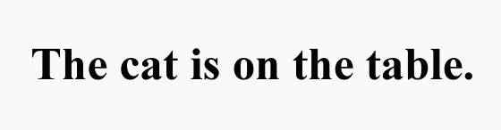

# CycleTrans: Unpaired Language Translation with Adversarial and Cycle Consistency

  

CycleTrans is an advanced model for **unpaired language translation**, using **adversarial training** and **cycle consistency** to translate between languages without requiring parallel datasets. This model allows seamless translation between languages such as **English** and **Italian** using two separate, unaligned datasets.

## 🚀 Overview
CycleTrans is built to work with unpaired datasets—meaning you don't need exact translations for each sentence. It uses **two generators** and **two discriminators** inspired by **Generative Adversarial Networks (GANs)** to ensure high-quality translations. The model also incorporates **cycle consistency** to maintain translation accuracy between languages.

### Key Features:
- **Unpaired Data**: Train the model with two separate datasets (e.g., English and Italian).
- **Adversarial Training**: The generators produce translations while the discriminators help improve their quality.
- **Cycle Consistency**: Ensures that translating between languages in both directions yields the same original sentence.
- **Contrastive Loss**: Aligns sentences in the shared embedding space for better translation quality.

## 🧠 How It Works

CycleTrans architecture consists of:
1. **Shared Embedding Layer**: A shared embedding that maps both English and Italian sentences into the same representation space.
2. **Two Generators**:
   - **G_E2I (English to Italian)**: Translates from English to Italian.
   - **G_I2E (Italian to English)**: Translates from Italian to English.
3. **Two Discriminators**:
   - **D_E (English Discriminator)**: Ensures realistic English translations.
   - **D_I (Italian Discriminator)**: Ensures realistic Italian translations.
4. **Cycle Consistency**: Ensures that translated sentences, when converted back to the original language, remain close to the initial sentence.
5. **Adversarial and Contrastive Losses**: Improve the quality of translations by leveraging adversarial training and sentence alignment.

## 💻 Getting Started

### Running the Notebook:
To try out the model, you can run the **CycleTrans notebook** in Google Colab or locally:

Run the notebook for training, evaluation, and testing on your own datasets.

## 📚 Citation
If you use CycleTrans in your work, please consider citing this project:

@misc{cycletrans2024,
  author = Davide Brunori,
  title = {CycleTrans: Unpaired Language Translation with Adversarial and Cycle Consistency},
  year = {2024},
  url = {https://github.com/dixy52-beep/translation-CycleTRANS-and-Adversal-Network}
}

## 💡 Contribute
CycleTrans is an open-source project! Feel free to fork, submit issues, and create pull requests. Contributions are always welcome!

- Improve the model
- Add new language support
- Update documentation
- Report bugs or suggest features

## Publications
[\[Translating Unknown Languages is now possible with AI - medium article (2024)\]](https://medium.com/@dbrunori5/translating-unknown-scripts-is-now-possible-with-ai-bbe147580f33) 
